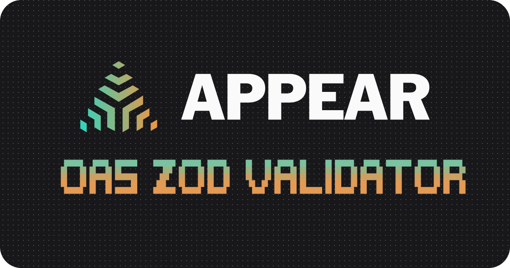

<!-- PROJECT LOGO -->
<p align="center">
  <a href="https://github.com/appear-sh/OAS-Zod-Validator">
   
  </a>

  <h3 align="center">OAS Zod Validator</h3>

  <p align="center">
    The open-source OpenAPI Spec Validator using Zod. From Appear.
    <br />
    <a href="https://docs.appear.sh/resources/open-source"><strong>Learn more »</strong></a>
    <br />
    <br />
    <a href="https://www.appear.sh">Appear Website</a>
    ·
    <a href="https://github.com/appear-sh/OAS-Zod-Validator/issues">Issues</a>
    ·
    <a href="https://www.appear.sh/productmap">Appear Product Map</a>
  </p>
</p>

# OAS Zod Validator

A robust OpenAPI Specification (OAS) validator built with Zod, providing type-safe schema validation for both OAS 3.0.x and 3.1 specifications.

[](https://www.npmjs.com/package/@appear.sh/oas-zod-validator)
[](https://opensource.org/licenses/MIT)

<!-- ABOUT THE PROJECT -->

## Features

- Full OpenAPI 3.0.x and 3.1 support
- Type-safe validation using Zod
- Detailed error messages with path information
- Zero external runtime dependencies
- Enterprise-ready with strict mode validation
- Supports both YAML and JSON formats
- Interactive CLI with rich reporting
- Comprehensive numeric format validations
- Rate limit header enforcement options
- Custom format validators
- Performance optimization with caching for large schemas
- Realworld examples you can quickly validate for assessments

<!-- GETTING STARTED -->

## NPX for on the fly spec validation in the CLI

```bash
npx @appear.sh/oas-zod-validator path/to/your/spec.json
```

## Installation

```bash
npm install oas-zod-validator
```

## Quick Start

```typescript
import { validateOpenAPI } from 'oas-zod-validator';

// Validate an OpenAPI spec (JSON or YAML)
const result = validateOpenAPI({
  openapi: '3.0.0',
  info: {
    title: 'My API',
    version: '1.0.0',
  },
  paths: {
    '/hello': {
      get: {
        responses: {
          '200': {
            description: 'Success',
          },
        },
      },
    },
  },
});

if (result.valid) {
  console.log('✅ Valid OpenAPI specification');
} else {
  console.error('❌ Validation errors:', result.errors);
}
```

## CLI Usage

```bash
# Install globally
npm install -g oas-zod-validator

# Validate a spec file
oas-validate api.yaml

# With strict validation options
oas-validate --strict --rate-limits api.json

# Interactive mode with guidance
oas-validate --interactive

# JSON output for CI/CD pipelines
oas-validate --json api.yaml
```

## Advanced Usage

### Performance Optimization with Caching

Caching is enabled by default and significantly improves performance for repeated validations of the same specification:

```typescript
// Validate with default caching (enabled)
const result = validateOpenAPI(spec);

// Disable caching if needed
const resultNoCache = validateOpenAPI(spec, {
  cache: { enabled: false },
});

// Configure cache size
const resultWithLargeCache = validateOpenAPI(spec, {
  cache: { maxSize: 1000 },
});

// Reset the cache manually
import { resetCache } from 'oas-zod-validator';
resetCache();

// Configure the global cache
import { configureCache } from 'oas-zod-validator';
configureCache({ maxSize: 2000 });
```

The caching system optimizes:

- OpenAPI document validation
- YAML/JSON parsing
- Reference resolution

This is particularly beneficial for:

- Large API specifications
- CI/CD pipelines with repeated validations
- Development workflows with incremental changes

### Custom Format Validation

```typescript
// Define custom format validators
const phoneValidator = (value: string) => {
  return /^\+[1-9]\d{1,14}$/.test(value);
};

// Use in validation
const result = validateOpenAPI(spec, {
  customFormats: {
    phone: phoneValidator,
  },
});
```

### Combining Multiple Options

```typescript
const result = validateOpenAPI(spec, {
  strict: true,
  allowFutureOASVersions: true,
  strictRules: {
    requireRateLimitHeaders: true,
  },
  customFormats: {
    phone: phoneValidator,
  },
});
```

### Configuration File

Create `.oas-validate.json` for persistent options:

```json
{
  "strict": true,
  "allowFutureOASVersions": false,
  "requireRateLimitHeaders": true,
  "format": "pretty"
}
```

## Documentation

- [Schema Validation Guide](./docs/schemas.md)
- [Format Support](./docs/formats.md)
- [Validation Options](./docs/validation.md)
- [Error Reference](./docs/errors.md)
- [Examples](./docs/examples/)

## Development

```bash
# Install dependencies
npm install

# Run tests (uses Vitest)
npm test

# Run tests in verbose mode (uses Vitest)
VERBOSE_INTEGRATION=1 npm test

# Watch mode for development
npm run test:watch

# Build
npm run build
```

This project uses TypeScript with ESM modules and Vitest for testing. It follows strict coding practices and maintains high test coverage.

<!-- CONTRIBUTING -->

## Contributing

Contributions are welcome! Please follow these steps:

1.  **Fork & Clone:** Fork the repository and clone it locally.
2.  **Branch:** Create a new branch for your feature or bug fix.
3.  **Develop:** Make your code changes. Ensure tests pass (`npm test`).
4.  **Add a Changeset:** This project uses [Changesets](https://github.com/changesets/changesets) to manage releases and generate changelogs. If your change impacts the package (e.g., bug fix, new feature, performance improvement), you **must** add a changeset file. Run the following command:
    ```bash
    npm run changeset
    ```
    Follow the prompts:
    - Select `oas-zod-validator` as the package.
    - Choose the appropriate SemVer bump level (patch, minor, or major) based on your changes.
    - Write a concise description of your change. This description will appear in the `CHANGELOG.md`.
5.  **Commit:** Commit your code changes _and_ the generated markdown file located in the `.changeset/` directory (e.g., `.changeset/sweet-donkeys-cry.md`).
6.  **Push & PR:** Push your branch and open a Pull Request against the `main` branch.

Maintainers will handle the versioning and release process using the changeset files provided in merged Pull Requests.

<!-- LICENSE -->

## License

- MIT © Thomas Peterson + Jakub Riedl @ https://www.appear.sh

<!-- ACKNOWLEDGEMENTS -->

## Core maintainers

- X: https://x.com/tom_mkv
- X: https://x.com/jakubriedl
- X: https://x.com/appearapi

For bug reports, feature requests, or contributions, please visit the [GitHub repository](https://github.com/appear-sh/OAS-Zod-Validator).
